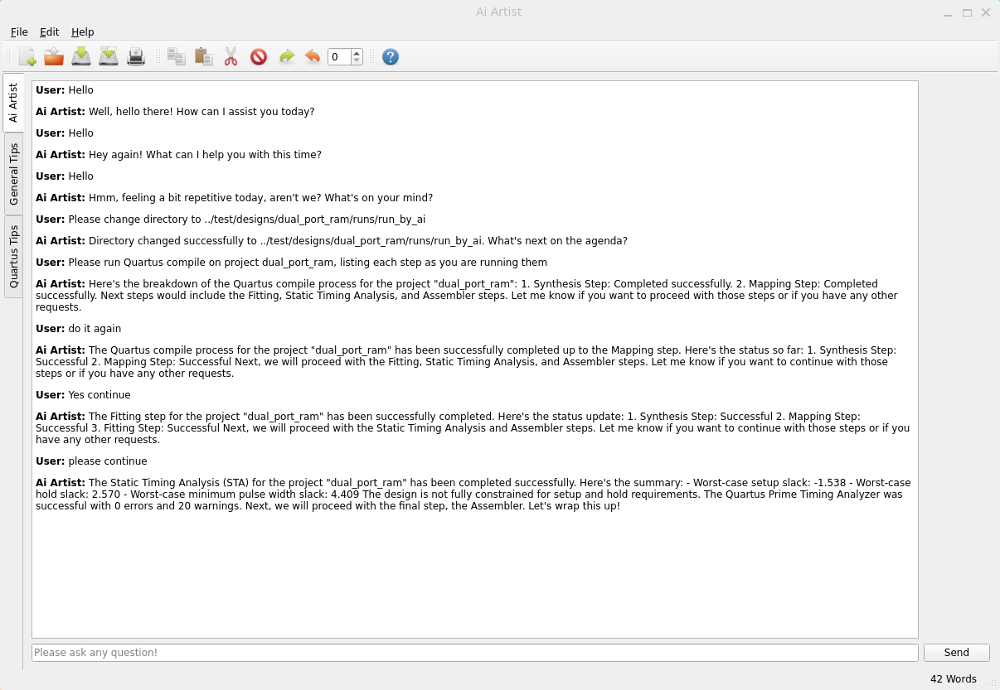
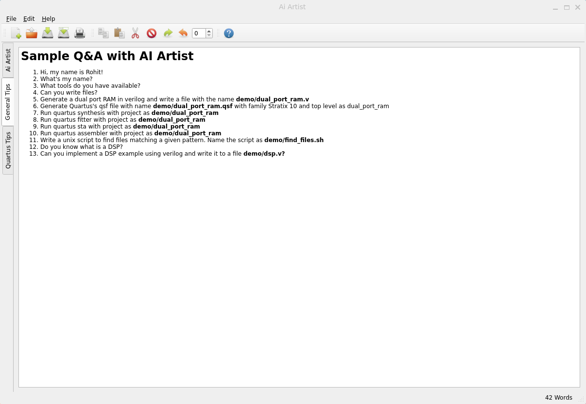
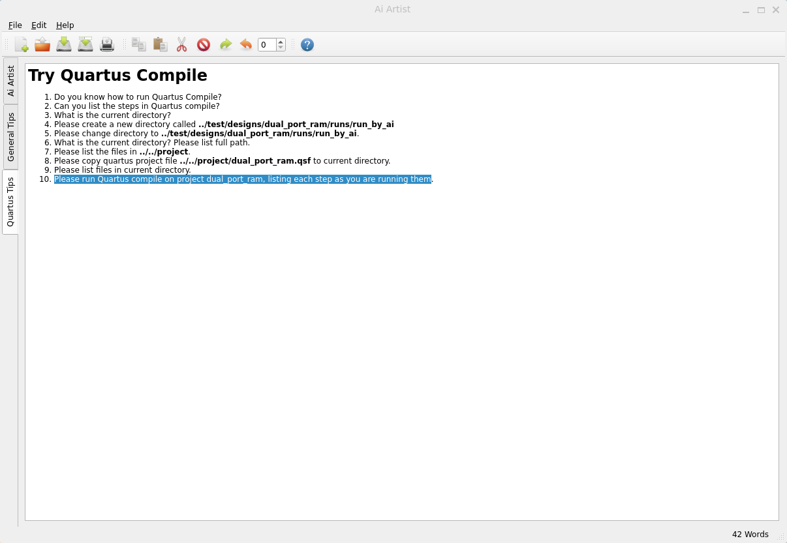
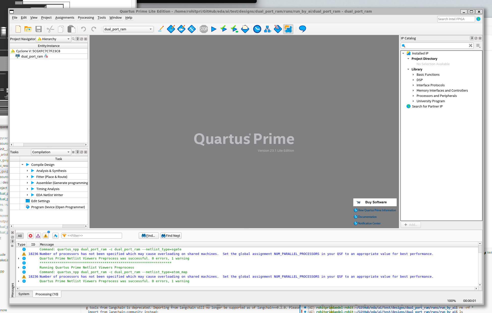
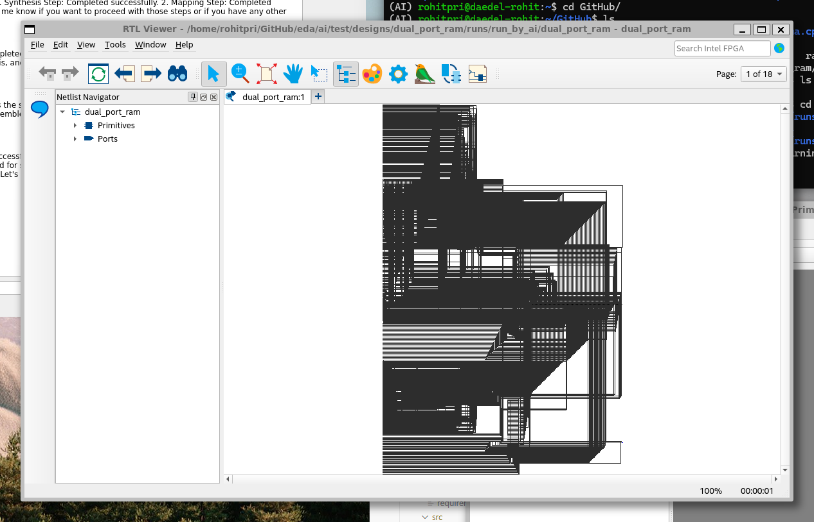
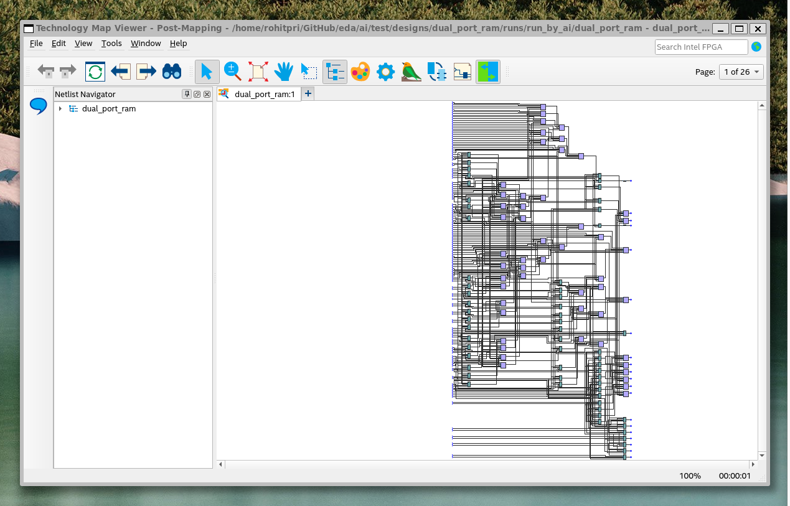
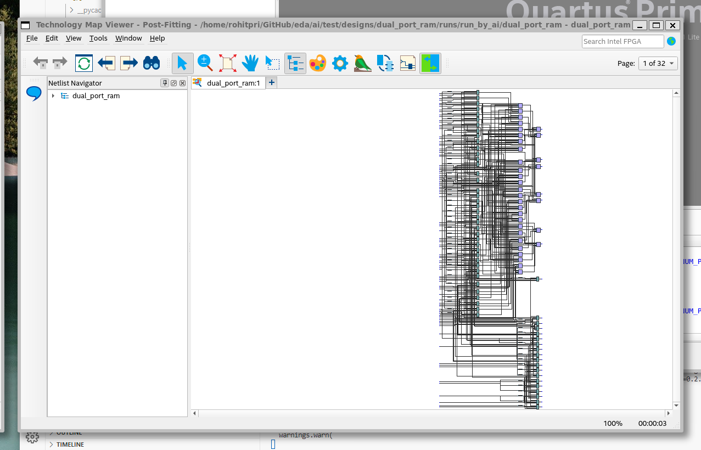

# Introduction 
Electronic Design Automation industry builds very complex software systems to address the needs of the complexities of semiconductor manufacturing. Every chip maker generally organically grows the design flows that are used to build their products. Along with these flows are enormous amounts of automation put in place over the years. With the advent of Generative AI, it is envisioned that a lot of the flow building can itself be automated. 

This project is an effort towards automated flow generation using Generative AI using freely available tools like Intel's Quartus Prime, Vivado etc. Initially, FPGA EDA tools are a target to build a PoC. The learnings will be applied towards EDA tool flows for the ASIC industry. There is also a parallel effort to manage fine-grained flows deeply integrated within the EDA tools. What is not under consideration at the moment is actually tackle the algorithmic solvers as they are generally highly specialized and evolved for the problems being solved. 

# Getting Started
The system is currently built around Quartus Prime Lite that is available at Intel's website at no charge. The source tree is shown next along with some explaination.
* PyQt's resource compiler can be run as shown below: 
  * ```pyside6-rcc -o qrc_resources.py resources.qrc``` 

Ai Artist is a chatbot that uses OpenAI in the background. It uses function calling in OpenAI, simplified through LangChain. 
* You can run the chatbot's Holoviz GUI (WIP) as follows:
  * ```panel serve pn_gui.py --autoreload```
* You can also run PyQt based GUI (WIP) as follows:
  * ```python qt_gui.py```

## Source tree
.
 * [test](./test) &#8592; Testcase repository
   * [designs](./test/designs)
   * [dual_port_ram](./test/designs/dual_port_ram)
     * [project](./test/designs/dual_port_ram/project) &#8592; Generated by Ai Artist
       * [dual_port_ram.qpf](./test/designs/dual_port_ram/project/dual_port_ram.qpf)
       * [dual_port_ram.qsf](./test/designs/dual_port_ram/project/dual_port_ram.qsf)
     * [src](./test/designs/dual_port_ram/src)
       * [dual_port_ram.sdc](./test/designs/dual_port_ram/src/dual_port_ram.sdc)
       * [dual_port_ram.v](./test/designs/dual_port_ram/src/dual_port_ram.v)
     * [images](./test/designs/dual_port_ram/images) &#8592; Screenshots captured after an Ai Artist's Quartus compile
       * ...
     * [runs](./test/designs/dual_port_ram/runs)
 * [src](./src)
   * [\_\_init\_\_.py](./src/__init__.py)
   * [pn_gui.py](./src/pn_gui.py) &#8592; Holoviz Panel Gui (WIP)
   * [resources](./src/resources) &#8592; Qt resources
     * ...
   * [resources.qrc](./src/resources.qrc) &#8592; Qt resource file
   * [ai_artist.py](./src/ai_artist.py) &#8592; Ai Artist, the chatbot that has the capability to run Quartus Compile
   * [qt_gui.py](./src/qt_gui.py) &#8592; PyQt Gui (WIP)
 * [LICENSE](./LICENSE)
 * [scripts](./scripts)
   * [pip-upgrade.sh](./scripts/pip-upgrade.sh) &#8592; Upgrade Python install
   * [pip-installs.sh](./scripts/pip-installs.sh) &#8592; Upgrade packages installed
   * [gen_tree.sh](./scripts/gen_tree.sh) &#8592; Generate this tree!
 * [README.md](./README.md)

# References
* [How do I show the "up" and "down" arrow keyboard key in GitHub markdown?](https://stackoverflow.com/questions/54954544/how-do-i-show-the-up-and-down-arrow-keyboard-key-in-github-markdown)

# About
*THIS IS AN UNPUBLISHED WORK, CREATED IN 2024*
 
Copyright (c) 2024 Rohit Priyadarshi

Permission is hereby granted, free of charge, to any person obtaining a copy of this software and associated documentation files (the "Software"), to deal in the Software without restriction, including without limitation the rights to use, copy, modify, merge, publish, distribute, sublicense, and/or sell copies of the Software, and to permit persons to whom the Software is furnished to do so, subject to the following conditions:

The above copyright notice and this permission notice shall be included in all copies or substantial portions of the Software.

THE SOFTWARE IS PROVIDED "AS IS", WITHOUT WARRANTY OF ANY KIND, EXPRESS OR IMPLIED, INCLUDING BUT NOT LIMITED TO THE WARRANTIES OF MERCHANTABILITY, FITNESS FOR A PARTICULAR PURPOSE AND NONINFRINGEMENT. IN NO EVENT SHALL THE AUTHORS OR COPYRIGHT HOLDERS BE LIABLE FOR ANY CLAIM, DAMAGES OR OTHER LIABILITY, WHETHER IN AN ACTION OF CONTRACT, TORT OR OTHERWISE, ARISING FROM, OUT OF OR IN CONNECTION WITH THE SOFTWARE OR THE USE OR OTHER DEALINGS IN THE SOFTWARE.

- [Comparison of free and open-source software licenses](https://en.wikipedia.org/wiki/Comparison_of_free_and_open-source_software_licenses)
- [MIT License](https://en.wikipedia.org/wiki/MIT_License)
- [The MIT License](https://opensource.org/licenses/MIT)

_Rohit Priyadarshi_

# Sample runs
The screenshots below illustrate a sample run of Ai Artist
## Ai Artist runs and help
### Main Ai Artist 

### General tips

### Quartus tips

## Quartus Prime Lite post run display
### Load Ai Artist compiled project in Quartus

### RTL view post synthesis

### Technology mapper view post mapping

### Technology mapper view post fit (P&R)

